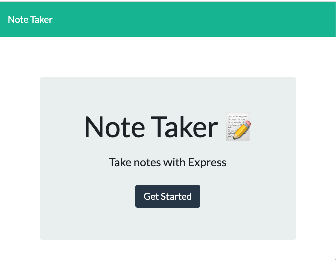
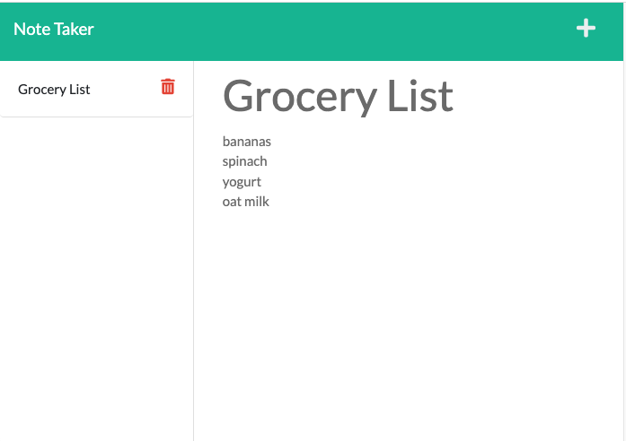

# Note Taker

## Description
Note Taker is a web application that can be used to write, save, and delete notes. 

## Table of Contents

* [Installation](#Installation)

* [Usage](#Usage)

* [Development](#Development)

* [License](#License)

* [Questions](#Questions)

## Installation
To install this application, the user must have node.js installed on their device and a system for running command-line applications, such as terminal.

This application uses Express.js and UUID packages that can be downloaded from the command-line, as well as native node modules fs and util.

## Usage
When the user opens the web application, they are presented with a landing page with a link to the notes page. 

When they click on the link, the user is directed to a page with exisiting notes on the left-hand column, and empty fields to enter a new note on the right-hand column.

When the user enters a new note title and text, a save icon appears in the upper right-hand corner of the navigation bar. When the save icon is clicked, the note moves into the left-hand column with the other saved notes.

When the user clicks on an existing note in the left column, that note appears in the right column. 

When the user clicks the delete icon next to the note, the note is deleted. 

## Development
The front-end of this application was developed using html, css, and javaScript.

The back-end of this application was developed using node.js, express.js, uuid, fs, and util. 

## License
This application is licensed under MIT.

## Questions
If you have any questions or note any issues with this application please contact me at:

[Github](https://www.github.com/edanahy22)

[Email](mailto:elainedanahy2022@u.northwestern.edu)